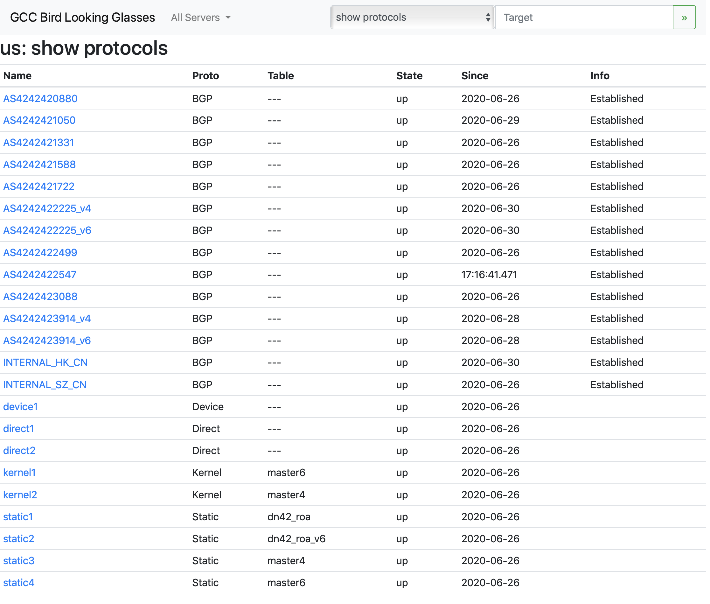

# Bird Looking Glass

基于 [xddxdd/bird-lg-go](https://github.com/xddxdd/bird-lg-go) ，按照个人喜好修改的 Bird Looking Glass。

仅支持Linux系统和bird2。

Client默认监听8000端口，Server默认监听5000端口。

# 编译

直接cd到对应文件夹，`go build`即可。

# Usage

Client:

```
./bird-lg-client
```

Server:

```
./bird-lg-server --servers=los-angeles-us,hongkong-cn --domain=dn42.gcc.ac.cn
```

注：每台`client`都需要分配一个域名。例如我这里两个`client`的域名是`los-angeles-us.dn42.gcc.ac.cn`和`hongkong-cn.dn42.gcc.ac.cn`

# Screenshot


